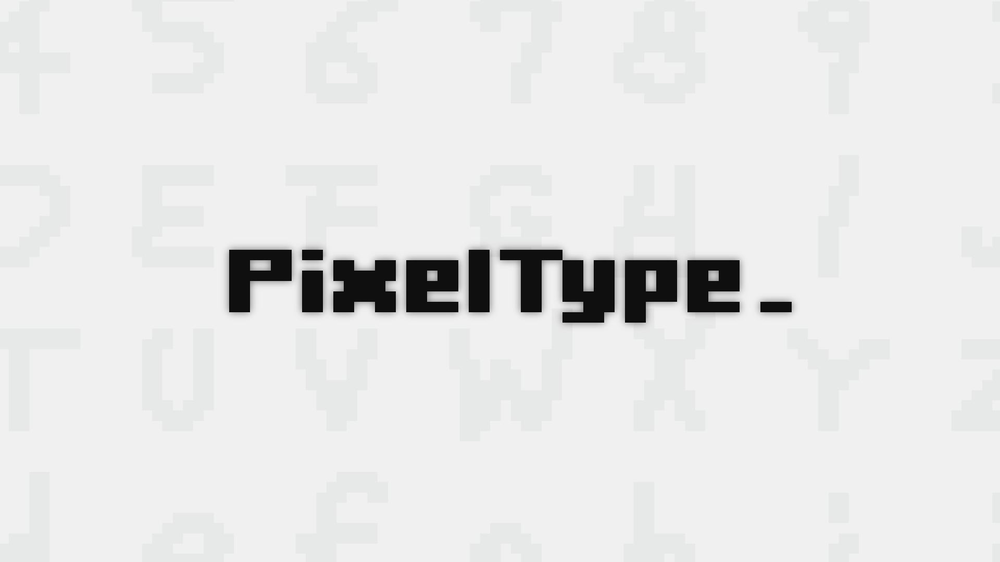

# PixelType.Core
Internal font engine of [PixelType](https://ruccho.com/pixeltype/) including TrueType font serializer written in C#.  
This repository doesn't contain any frontend code and converter from image to glyph.

### About PixelType

PixelType is a tool that can generate pixel fonts from images.

- [Portal](https://ruccho.com/pixeltype/)
- [Demo](https://ruccho.com/pixeltype/demo/index.html)
- [Steam store page](https://store.steampowered.com/app/2127930/PixelType/)

